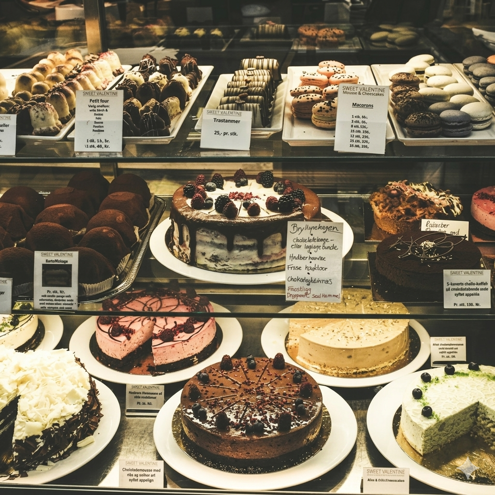

# 🎂 Cake-House — Landing Page

A delightful and elegant cake shop landing page built as a portfolio demo project. Designed to capture the warmth and craftsmanship of a real artisan bakery — handcrafted cakes, premium ingredients, and beautiful presentation.

🔗 **Live Demo:** [pranav-gt.github.io/Cake_Shop_Landing-page](https://pranav-gt.github.io/Cake_Shop_Landing-page/)

---

## 📸 Preview



---

## ✨ Features

- **Hero Section** — Warm headline "Love At First Bite" with an Order Now CTA
- **About Section** — Bakery story highlighting custom cakes, brownies, and gourmet sweets
- **Products Section** — 16 product cards across four filterable categories: Vanilla, Chocolate, Strawberry, and Others, each with a name and description
- **Testimonials** — Auto-scrolling carousel of six customer reviews with star ratings
- **Contact Section** — Address, email, phone, opening hours, and a contact form
- **Fully Responsive** — Works smoothly across desktop, tablet, and mobile

---

## 🛠️ Tech Stack

| Technology | Usage |
|---|---|
| HTML5 | Page structure and semantics |
| CSS3 | Styling, layout, and responsiveness |
| JavaScript | Product filtering, testimonial carousel, and UI interactions |

> No frameworks or libraries — pure vanilla front-end.

---

## 🍰 Product Categories

| Category | Products |
|---|---|
| **Vanilla** | Golden Hour, Pure Bliss, Sweet Serenity, Ivory Lace |
| **Chocolate** | Cookies & Crave, The Loaded, Midnight Indulgence, Dark Romance |
| **Strawberry** | Cherry on Top, Ruby Velvet, Strawberry Cloud, Raspberry Rush |
| **Others** | The Classic Square, Tiramisu Cups, Lattice & Blues, Molten Stack |

---

## 📁 Project Structure

```
Cake_Shop_Landing-page/
├── index.html              # Main HTML file
├── style.css               # Stylesheet
├── script.js               # JavaScript (filtering, carousel, interactions)
└── Images/
    ├── logo.svg
    ├── leaf-3.png
    ├── Home-img.png
    ├── about-img.png
    ├── V-1.png             # Vanilla cakes
    ├── V-4.png
    ├── v-3.png
    ├── v-2.png
    ├── chocolat-1.png      # Chocolate cakes
    ├── chocolat-2.png
    ├── chocolat-3.png
    ├── Chocolate-4.png
    ├── s-2.png             # Strawberry cakes
    ├── s-4.png
    ├── strawberry-1.png
    ├── strawberry-3.png
    ├── brownie.png         # Others
    ├── cupcake.png
    ├── pie.png
    └── O-4.png
```

---

## 🚀 Getting Started

To run locally:

```bash
# Clone the repository
git clone https://github.com/pranav-gt/Cake_Shop_Landing-page.git

# Navigate into the folder
cd Cake_Shop_Landing-page

# Open in browser
open index.html
```

Or just open `index.html` directly in your browser — no build step needed.

---

## 🎯 Purpose

This project was built as a **portfolio demo** to demonstrate front-end development skills including:

- Semantic HTML structure
- Responsive CSS layouts
- Dynamic product filtering with JavaScript
- Auto-scrolling testimonial carousel
- Real-world UI patterns (hero, filterable product grid, review carousel, contact form)

---

## 📄 License

This project is open source and available under the [MIT License](LICENSE).

---

> Built with 🎂 by [Pranav](https://github.com/pranav-gt)
